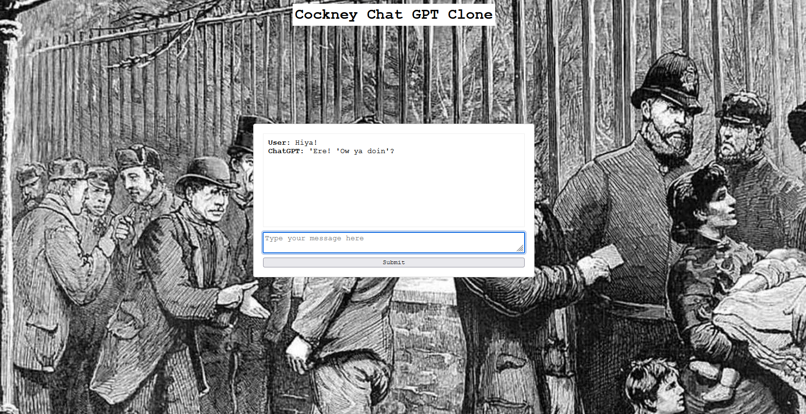

  

# Cockney Chat GPT Clone

## Description

A chatGPT API driven chatbot that responds in London Cockney slang. The app was developed using HTML, CSS and Javascript connecting to the openAI API. User and Open AI responses are logged in order to allow the chat bot to reference previous aspects of the conversation and
to allow conversational flow. Max tokens are also tweaked to improve performance and userbility.

## Deployment

The site is deployed on Netlify:

https://main--guileless-dragon-49c84e.netlify.app/

## Acknowledgments

- Open AI API
